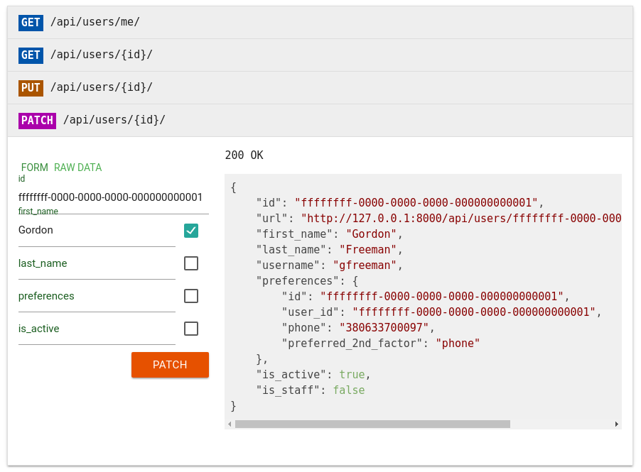

# DRFBro

A Django extension that provides a better Django REST Framework browser.

**This app is currently in beta.**




# Requirements

- Django 1.9+
- Django REST Framework 3.6+
- Built in React & Materialize

# But why?

Swagger? It's great, but...

  - There have been numerous problems integrating it with DRF schema.
  - It's not as customizable as you'd expect.

DRF Docs?

  - Doesn't work with recent DRF.

DRF AutoDoc?

  - Doesn't work with recent DRF.

So I'm writing this yet-another-one browser for DRF API.

# Installation

1. Install DRFBro

    ```sh
    pip install drfbro
    ```

2. Add it to your INSTALLED_APPS

    ```python
    INSTALLED_APPS = [
        # ...
        'rest_framework',
        'rest_framework.authtoken',  # Required for DRFBro authentication
        # ...
        'drfbro',
        # ...
    ]
    ```

3. Enable `TokenAuthentication`  in your DRF config

    ```python
    REST_FRAMEWORK = {
        'DEFAULT_AUTHENTICATION_CLASSES': (
            # ...
            'rest_framework.authentication.TokenAuthentication',
            # ...
        ),
    }
    ```

4. Add DRFBro to your `urls.py`:

    ```python
    urlpatterns = [
        # ...
            url(r'^drfbro/', include('drfbro.urls')),
        # ...
    ]
    ```

5. Navigate to `http://127.0.0.1:8000/drfbro`

# License

The license is MIT.
